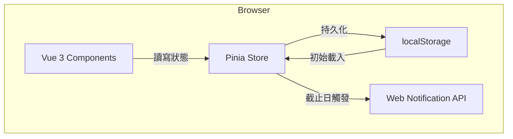
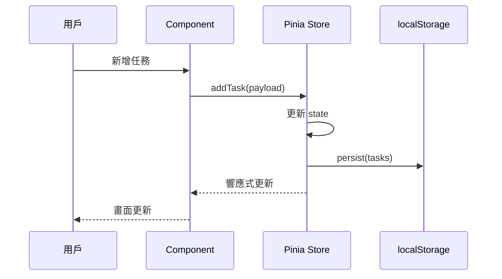

# ARCH — Todo List 系統架構設計

**文件版本：** v1.0
**建立日期：** 2026-06-17
**作者：** Architect Agent
**對應 PRD：** PRD-TodoList-20260617.md v1.1

---

## 目錄

1. [系統概覽](#1-系統概覽)
2. [目錄結構](#2-目錄結構)
3. [技術選型](#3-技術選型)
4. [模組設計](#4-模組設計)
5. [RWD 策略](#5-rwd-策略)
6. [Web Notification 整合](#6-web-notification-整合)
7. [任務拆解清單](#7-任務拆解清單)

---

## 1. 系統概覽

### 1.1 架構圖



### 1.2 資料流向



### 1.3 核心設計原則

- **無後端**：所有資料操作在瀏覽器端完成，localStorage 為唯一儲存層
- **單向資料流**：Component → Store → localStorage，不允許 Component 直接操作 localStorage
- **Composable 封裝**：業務邏輯抽至 composables，Component 保持純 UI 職責
- **漸進增強**：Web Notification 為輔助功能，不支援時降級至頁面內提示
- **Schema 版本化**：localStorage 資料結構帶版本號，支援未來格式升級

---

## 2. 目錄結構

```
todolist/
├── index.html
├── vite.config.js
├── package.json
└── src/
    ├── main.js                  # App 入口，掛載 Vue + Pinia
    ├── App.vue                  # 根元件，路由佈局
    ├── assets/
    │   ├── styles/
    │   │   ├── variables.css    # CSS 自訂屬性（顏色、間距、斷點）
    │   │   ├── reset.css        # CSS reset
    │   │   └── global.css       # 全域樣式
    │   └── icons/               # SVG icon 檔
    ├── components/
    │   ├── layout/
    │   │   ├── AppHeader.vue    # 頂部標題列 + 搜尋入口
    │   │   ├── AppSidebar.vue   # 清單導覽側欄（桌面版）
    │   │   └── AppNav.vue       # 底部導覽列（手機版）
    │   ├── task/
    │   │   ├── TaskList.vue     # 任務清單容器 + 排序控制
    │   │   ├── TaskItem.vue     # 單筆任務卡片
    │   │   ├── TaskForm.vue     # 新增/編輯任務表單
    │   │   └── TaskSubItem.vue  # 子任務列項目
    │   ├── list/
    │   │   ├── ListPanel.vue    # 清單管理面板
    │   │   └── ListItem.vue     # 單筆清單項目
    │   └── common/
    │       ├── BaseModal.vue    # 通用 Modal 容器
    │       ├── BaseButton.vue   # 通用按鈕
    │       ├── BaseInput.vue    # 通用輸入框
    │       ├── PriorityBadge.vue # 優先級標籤
    │       ├── EmptyState.vue   # 空狀態提示
    │       └── ConfirmDialog.vue # 刪除確認對話框
    ├── composables/
    │   ├── useTask.js           # 任務 CRUD 操作
    │   ├── useList.js           # 清單管理操作
    │   ├── useSearch.js         # 搜尋過濾邏輯
    │   ├── useSort.js           # 排序邏輯
    │   ├── useNotification.js   # Web Notification 封裝
    │   └── useStorage.js        # localStorage 讀寫封裝
    ├── stores/
    │   ├── taskStore.js         # 任務狀態（Pinia）
    │   └── listStore.js         # 清單狀態（Pinia）
    └── utils/
        ├── dateUtils.js         # 日期格式化、截止日計算
        ├── idUtils.js           # UUID 產生
        └── storageSchema.js     # localStorage schema 定義與版本遷移
```

---

## 3. 技術選型

| 層級 | 選擇 | 理由 |
|------|------|------|
| 框架 | Vue 3 Composition API | 已決定 |
| 打包 | Vite | 已決定 |
| 狀態管理 | Pinia | Vue 3 官方推薦，比 Vuex 更輕量，TypeScript 友好，devtools 支援好 |
| 樣式 | 原生 CSS + CSS Variables | 無框架依賴，bundle size 最小，CSS Variables 原生支援深色模式 |
| 日期選擇 | 瀏覽器原生 `<input type="datetime-local">` | 無需額外套件，行動裝置體驗佳 |
| ID 產生 | `crypto.randomUUID()` | 瀏覽器原生，無需套件 |
| 圖示 | SVG inline / heroicons | 輕量，可用 CSS 控制顏色 |
| 部署 | GitHub Pages | 免費靜態托管，CI/CD 簡單 |

**捨棄的替代方案：**
- Tailwind CSS → 本專案規模小，原生 CSS 維護成本更低，避免引入 purge 設定複雜度
- Vuex → Pinia 已是 Vue 3 標準，Vuex 5 已廢棄
- day.js → 本專案日期操作簡單，原生 `Intl.DateTimeFormat` 已足夠

---

## 4. 模組設計

### 4.1 元件職責

| 元件 | 職責 | Props | Emits |
|------|------|-------|-------|
| `TaskList` | 渲染任務列表、排序控制 | `listId` | — |
| `TaskItem` | 顯示單筆任務、勾選/刪除 | `task` | `toggle`, `delete`, `edit` |
| `TaskForm` | 新增/編輯任務表單 | `task?`（編輯時傳入） | `submit`, `cancel` |
| `TaskSubItem` | 子任務勾選顯示 | `subTask` | `toggle`, `delete` |
| `AppSidebar` | 清單導覽，桌面版顯示 | — | `selectList` |
| `AppNav` | 底部導覽，手機版顯示 | — | `selectList` |
| `BaseModal` | 通用彈窗容器 | `visible`, `title` | `close` |
| `ConfirmDialog` | 刪除確認彈窗 | `message` | `confirm`, `cancel` |

### 4.2 Composable 設計

#### `useTask.js`
```js
export function useTask() {
  const store = useTaskStore()

  const addTask = (payload) => { /* ... */ }
  const updateTask = (id, payload) => { /* ... */ }
  const deleteTask = (id) => { /* ... */ }
  const toggleTask = (id) => { /* ... */ }
  const addSubTask = (taskId, title) => { /* ... */ }
  const toggleSubTask = (taskId, subId) => { /* ... */ }

  return { addTask, updateTask, deleteTask, toggleTask, addSubTask, toggleSubTask }
}
```

#### `useList.js`
```js
export function useList() {
  const store = useListStore()

  const addList = (name) => { /* ... */ }
  const renameList = (id, name) => { /* ... */ }
  const deleteList = (id) => { /* ... */ }   // 同時刪除該清單下所有任務
  const archiveList = (id) => { /* ... */ }

  return { addList, renameList, deleteList, archiveList }
}
```

#### `useSearch.js`
```js
export function useSearch(tasks) {
  const query = ref('')
  const filtered = computed(() =>
    query.value
      ? tasks.value.filter(t =>
          t.title.includes(query.value) || t.description?.includes(query.value)
        )
      : tasks.value
  )
  return { query, filtered }
}
```

#### `useSort.js`
```js
// sortBy: 'dueDate' | 'priority' | 'createdAt'
export function useSort(tasks) {
  const sortBy = ref('createdAt')
  const sorted = computed(() => [...tasks.value].sort(comparators[sortBy.value]))
  return { sortBy, sorted }
}
```

#### `useNotification.js`
```js
export function useNotification() {
  const isSupported = 'Notification' in window
  const permission = ref(Notification.permission)

  const requestPermission = async () => { /* ... */ }
  const scheduleReminder = (task) => { /* setTimeout 至截止前 15 分鐘 */ }
  const cancelReminder = (taskId) => { /* clearTimeout */ }

  return { isSupported, permission, requestPermission, scheduleReminder, cancelReminder }
}
```

### 4.3 localStorage Schema

```js
// storageVersion: 1
{
  "_version": 1,
  "lists": [
    {
      "id": "uuid",
      "name": "工作",
      "color": "#4F46E5",
      "archived": false,
      "createdAt": "2026-06-17T10:00:00.000Z"
    }
  ],
  "tasks": [
    {
      "id": "uuid",
      "listId": "uuid",          // 所屬清單 ID
      "title": "寄 Q2 報告",
      "description": "",
      "priority": "high",        // "high" | "medium" | "low"
      "dueDate": "2026-06-17T18:00:00.000Z",  // null 表示無截止日
      "completed": false,
      "completedAt": null,
      "subTasks": [
        {
          "id": "uuid",
          "title": "草稿",
          "completed": false
        }
      ],
      "createdAt": "2026-06-17T09:00:00.000Z",
      "updatedAt": "2026-06-17T09:00:00.000Z"
    }
  ]
}
```

**預設清單：** 初始化時自動建立「收件匣」清單（id: `inbox`），作為未分類任務的容器。

### 4.4 Pinia Store 結構

#### `taskStore.js`
```js
export const useTaskStore = defineStore('tasks', {
  state: () => ({
    tasks: []           // Task[]
  }),
  getters: {
    byList: (state) => (listId) => state.tasks.filter(t => t.listId === listId),
    incomplete: (state) => state.tasks.filter(t => !t.completed),
    completed: (state) => state.tasks.filter(t => t.completed),
  },
  actions: {
    load() { /* 從 localStorage 讀取 */ },
    persist() { /* 寫入 localStorage */ },
    // CRUD actions...
  }
})
```

---

## 5. RWD 策略

### 5.1 斷點定義

```css
/* variables.css */
--bp-mobile: 375px;
--bp-tablet: 768px;
--bp-desktop: 1280px;
```

### 5.2 三種佈局

**手機（< 768px）**
```
┌─────────────────┐
│   Header + 搜尋  │
├─────────────────┤
│                 │
│   任務清單       │
│                 │
├─────────────────┤
│  底部導覽列      │  ← AppNav（清單切換）
└─────────────────┘
```

**平板（768px – 1279px）**
```
┌────┬────────────┐
│側欄│  Header    │
│清單├────────────┤
│導覽│  任務清單   │
│    │            │
└────┴────────────┘
```

**桌面（≥ 1280px）**
```
┌──────┬─────────────────────┐
│      │  Header + 搜尋       │
│ 側欄 ├─────────────────────┤
│ 清單 │  任務清單（寬版）     │
│ 導覽 │                     │
└──────┴─────────────────────┘
```

### 5.3 Media Query 策略

採用 **Mobile First**：預設樣式為手機版，逐步用 `@media (min-width: ...)` 覆寫。

```css
/* Mobile（預設） */
.layout { display: flex; flex-direction: column; }

/* Tablet+ */
@media (min-width: 768px) {
  .layout { flex-direction: row; }
  .sidebar { display: block; }
  .app-nav { display: none; }
}
```

---

## 6. Web Notification 整合

### 6.1 流程

```
用戶設定截止日
    ↓
scheduleReminder(task)
    ↓
計算距截止前 15 分鐘的 delay
    ↓
setTimeout(delay, () => showNotification(task))
    ↓
頁面關閉 → reminder 失效（無 Service Worker，此為已知限制）
```

### 6.2 Safari 降級

| 環境 | 行為 |
|------|------|
| 支援 Notification API + 已授權 | 顯示系統通知 |
| 支援但未授權 | 引導授權，拒絕則顯示頁面內 toast 提示 |
| 不支援（Safari iOS 16 以下） | 僅顯示頁面內 toast，不顯示授權請求 |

### 6.3 已知限制

- 網頁關閉後提醒失效（需 Service Worker + Push API，列為 v2.0 規劃）
- iOS Safari 對 Notification API 支援有限，為已知降級場景

---

## 7. 任務拆解清單

### Phase 1：專案初始化與基礎架構（第 1 週）

| ID | 任務名稱 | 描述 | 工時 | 依賴 | 優先級 |
|----|----------|------|------|------|--------|
| T-001 | 專案初始化 | `npm create vite`，安裝 Pinia，設定 ESLint + Prettier，建立目錄結構 | 2h | — | Must |
| T-002 | CSS 基礎設定 | 建立 `variables.css`（色彩、間距、斷點）、`reset.css`、`global.css`，確立深色模式變數 | 2h | T-001 | Must |
| T-003 | localStorage Schema 設計 | 實作 `storageSchema.js`，定義資料結構與版本遷移函式 | 2h | T-001 | Must |
| T-004 | `useStorage.js` Composable | 封裝 localStorage 讀寫，含 JSON parse/stringify 錯誤處理 | 1h | T-003 | Must |
| T-005 | Pinia taskStore | 建立 taskStore：state、getters（byList / incomplete / completed）、load/persist actions | 3h | T-004 | Must |
| T-006 | Pinia listStore | 建立 listStore：state、getters、load/persist actions，預設建立「收件匣」清單 | 2h | T-004 | Must |

**Phase 1 小計：12h**

### Phase 2：核心 UI 元件（第 1–2 週）

| ID | 任務名稱 | 描述 | 工時 | 依賴 | 優先級 |
|----|----------|------|------|------|--------|
| T-007 | 共用元件：BaseButton / BaseInput | 建立通用按鈕、輸入框元件，含 disabled、loading 狀態 | 2h | T-002 | Must |
| T-008 | 共用元件：BaseModal | 建立通用 Modal 容器，含背景遮罩、ESC 關閉、焦點陷阱 | 2h | T-007 | Must |
| T-009 | 共用元件：ConfirmDialog | 刪除確認對話框，基於 BaseModal | 1h | T-008 | Must |
| T-010 | 共用元件：PriorityBadge / EmptyState | 優先級標籤（高/中/低色彩）、空狀態插圖提示 | 1h | T-002 | Must |
| T-011 | AppHeader | 頂部標題列，含 App 名稱、搜尋觸發按鈕 | 2h | T-007 | Must |
| T-012 | AppSidebar（桌面）/ AppNav（手機） | 清單切換導覽，桌面側欄 / 手機底部 Tab，含 RWD 切換邏輯 | 3h | T-006 | Must |
| T-013 | RWD 佈局（App.vue） | 實作三斷點 Mobile First 佈局，整合 Header / Sidebar / Nav | 2h | T-011, T-012 | Must |

**Phase 2 小計：13h**

### Phase 3：任務核心功能（第 2–3 週）

| ID | 任務名稱 | 描述 | 工時 | 依賴 | 優先級 |
|----|----------|------|------|------|--------|
| T-014 | `useTask.js` Composable | 封裝 addTask / updateTask / deleteTask / toggleTask，呼叫 store actions | 2h | T-005 | Must |
| T-015 | TaskItem 元件 | 單筆任務卡片：標題、截止日、優先級 Badge、完成勾選、編輯/刪除按鈕 | 3h | T-010, T-014 | Must |
| T-016 | TaskList 元件 | 任務清單容器：渲染 TaskItem 列表，含「未完成」/「已完成」分區 | 2h | T-015 | Must |
| T-017 | TaskForm 元件 | 新增/編輯表單：標題輸入、描述、截止日（datetime-local）、優先級選擇、清單選擇 | 4h | T-008, T-014 | Must |
| T-018 | `dateUtils.js` | 截止日格式化、是否逾期判斷、距截止日剩餘時間計算 | 1h | T-001 | Must |
| T-019 | TaskSubItem + 子任務功能 | 子任務新增/刪除/勾選，整合至 TaskItem 展開區域 | 3h | T-015 | Should |

**Phase 3 小計：15h**

### Phase 4：清單管理與進階功能（第 3–4 週）

| ID | 任務名稱 | 描述 | 工時 | 依賴 | 優先級 |
|----|----------|------|------|------|--------|
| T-020 | `useList.js` Composable | 封裝 addList / renameList / deleteList / archiveList | 2h | T-006 | Should |
| T-021 | ListPanel / ListItem 元件 | 清單管理面板：新增、重新命名、刪除、封存清單 | 3h | T-020, T-008 | Should |
| T-022 | `useSort.js` Composable + UI | 實作三種排序（截止日 / 優先級 / 建立時間），TaskList 上方加排序控制列 | 2h | T-016 | Should |
| T-023 | `useSearch.js` Composable + UI | 全文搜尋即時過濾，Header 搜尋框展開動畫，手機版全寬搜尋 | 3h | T-011, T-016 | Should |

**Phase 4 小計：10h**

### Phase 5：通知、深色模式與優化（第 5 週）

| ID | 任務名稱 | 描述 | 工時 | 依賴 | 優先級 |
|----|----------|------|------|------|--------|
| T-024 | `useNotification.js` + 整合 | Web Notification 封裝、授權請求 UI、setTimeout 排程、Safari 降級 toast | 4h | T-018 | Should |
| T-025 | 深色模式 | CSS Variables 深色模式覆寫（`prefers-color-scheme`），手動切換 toggle | 2h | T-002 | Could |
| T-026 | 封存清單 UI | 封存清單摺疊顯示於側欄底部，可恢復封存 | 2h | T-021 | Could |
| T-027 | JSON 匯出功能 | 將 localStorage 資料匯出為 `.json` 檔案下載 | 1h | T-004 | Could |

**Phase 5 小計：9h**

### Phase 6：測試與部署（第 6 週）

| ID | 任務名稱 | 描述 | 工時 | 依賴 | 優先級 |
|----|----------|------|------|------|--------|
| T-028 | Lighthouse 效能優化 | 執行 Lighthouse，優化 FCP / LCP / Bundle size，確保 Score ≥ 90 | 3h | 全部 | Must |
| T-029 | 跨瀏覽器 RWD 測試 | Chrome / Firefox / Safari / Edge，三個斷點手動驗證 | 3h | 全部 | Must |
| T-030 | GitHub Pages 部署設定 | 設定 `vite.config.js` base path，建立 GitHub Actions CI/CD workflow | 2h | T-001 | Must |

**Phase 6 小計：8h**

---

### 任務總覽

| Phase | 任務數 | 預估工時 |
|-------|--------|----------|
| Phase 1：初始化 | 6 | 12h |
| Phase 2：核心 UI | 7 | 13h |
| Phase 3：任務功能 | 6 | 15h |
| Phase 4：清單與進階 | 4 | 10h |
| Phase 5：通知與優化 | 4 | 9h |
| Phase 6：測試部署 | 3 | 8h |
| **合計** | **30** | **67h** |

---

*文件由 Architect Agent 產出。技術決策如有調整，請更新此文件並記錄理由。*
